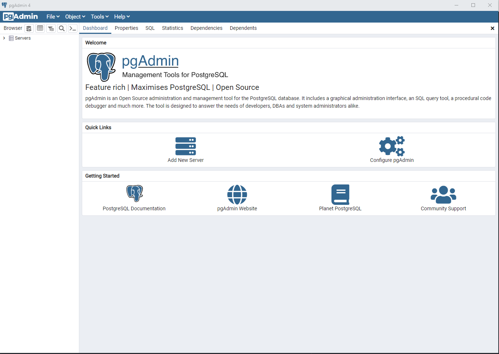

# DVD Rental Analysis Project In SQL

One of the criteria to graduate  at ***Udacity*** for the **Programming for
Data Science _Nano Degree_** is to successfully complete the IRD project.
This is the first project which focuses on _postgresql_. I work on several query
problem statements and save the solutions in csv files. After I get the SCVs,
I make a quick `Visualization` using a DataViz of my choice.

This project covers the important **Real World** `SQL questions` that usually
come to _interviews_.
I answer these `questions` using *sql* queries:

- Create a query that lists each movie, the film category it is classified in, and
the number of times it has been rented out. For this query, you will need 5 tables:
Category, Film_Category, Inventory, Rental and Film. Your solution should have three columns:
Film title, Category name and Count of Rentals.

- Now we need to know how the length of rental duration of these family-friendly
movies compares to the duration that all movies are rented for. Can you provide a table with
the movie titles and divide them into 4 levels (first_quarter, second_quarter,
third_quarter, and final_quarter) based on the quartiles (25%, 50%, 75%) of the rental
duration for movies across all categories? Make sure to also indicate the
category that these family-friendly movies fall into.

- Finally, provide a table with the family-friendly film category, each of the
quartiles, and the corresponding count of movies within each combination of film
category for each corresponding rental duration category. The resulting table
should have three columns: Category, Rental length category, Count

- Write a query that returns the store ID for the store, the year and month and
the number of rental orders each store has fulfilled for that month. Your table
should include a column for each of the following: year, month, store ID and
count of rental orders fulfilled during that month.

- We would like to know who were our top 10 paying customers, how many payments
they made on a monthly basis during 2007, and what was the amount of the monthly
payments. Can you write a query to capture the customer name, month and year of
payment, and total payment amount for each month by these top 10 paying customers?

- write a query to compare the payment amounts in each successive month.
Repeat this for each of these 10 paying customers. Also, it will be tremendously
helpful if you can identify the customer name who paid the most difference in terms
of payments.

## Datasets

There in only `one (1)` dataset form which I extracted data that answer to the above
questions. The dataset is **dvdrental.tar**.
However, those answered questions are saved into __CSV__ files as follow:
- set1 Qn1.csv
- set1 Qn2.csv
- set1 Qn3.csv
- set2 Qn1.csv
- set2 Qn2.csv
- set2 Qn3.csv

## Required Software

Software that is used to manage databases is **called Database Management System**
There are various **_Database Management System_** which are open source. In my case,
I use [**PostgreSQL**](https://www.postgresql.org/?msclkid=3848f428c97c11ecbb8d9f18983f2d43).
Once you have it installed in your PC, type `pdAdmin` in the search bar and open it.
I should look like this:
.
### How to restore the database in pgAdmin
The dvdrental.tar is the database to restore. (*do not unzip the file*)
Check [here](https://www.geeksforgeeks.org/postgresql-restore-database/?msclkid=03ebd8a8c97f11ec968a8b251b023c27).

## Acknowledgements

I would like to thank **_Udacity and Access Bank_** for giving me this chance. With this scholarship,
I am able to chase for a data science career. It is obvious that the journey is till long,
but thanks to this __Programming For Data Science Nano Degree__, I will end up in
a *data science role*.
Of course, this is the final project, which is among the recommendation in order
to actually graduate to the Nano degree. On behalf of scholars and everyone learning
on the Udacity platform, We cannot thank you enough. You are among the industries
that are making changes for the better future of this world!
                               **_NeverStopLearning_**
